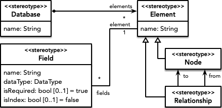
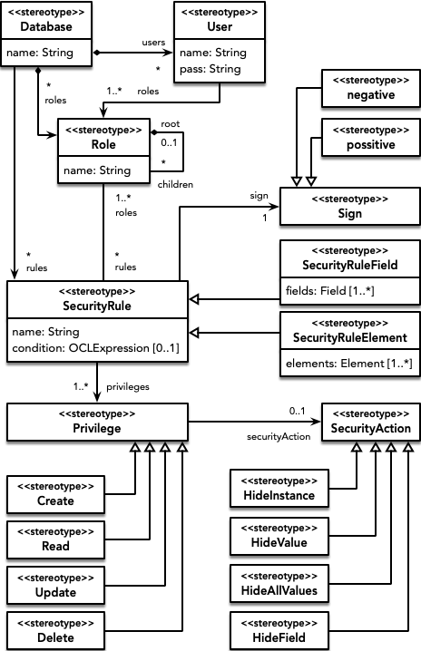

# Metamodels

When approaching security in NoSQL databases from a design point of view, we need on the one hand the structural aspects specific to the type of database (graph-oriented, document or columnar) and on the other hand the definition of security policies related with them, that can be independent and reusable for different types of NoSQL databases.

To assist in the design of security policies on graph-oriented databases, we present the following metamodels:

## Graph-oriented databases (structural concepts)

The metamodel for graph-oriented databases allows to establish all the necessary structural elements, so that a database has elements that can be Node or Relationship between two nodes. Both nodes and relationships can have associated Field with an associated DataType.

## Security policies on databases (regardless of their type)

The security metamodel allows establishing security policies on the database. To do so, it allows defining a set of security rules that grant or deny privileges (Create, Read, Update, Delete) on database elements to certain users. To classify database users, a role-based access control policy is used to define role hierarchies and associate users to them. This access control policy is the most widely used and supported by end tools. 
Security rules can be associated to database elements or fields of such elements (fine-grained). Depending on the type of NoSQL database we are using, these elements will refer to nodes and relationships, documents or columns.

