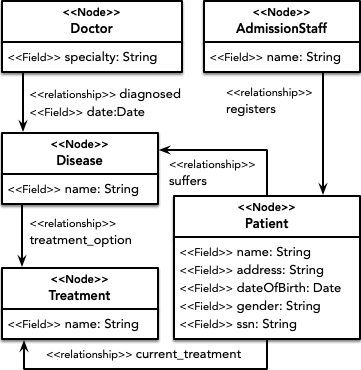
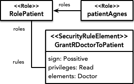
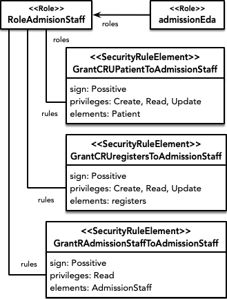
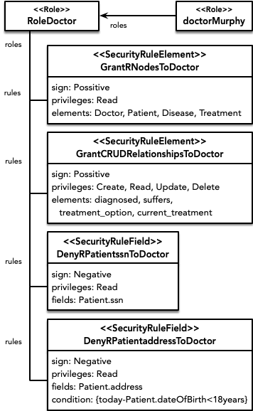

# Hospital

Case study related with the health domain, more specifically to the management of diagnostics, involving patients, doctors and associated treatments. 

Starting with the structural part, the following nodes, relationships and properties are defined. The administration staff (AdmissionStaff node) is in charge of registering patients (Patient node) and maintaining their associated information (name, address, social security number, etc.). Doctors (Doctor node) have an associated specialty and are in charge of diagnosing patients, so that patients have associated diseases (Disease node) diagnosed on a certain date by a certain doctor. In addition, each disease has a series of possible treatments associated with it (Treatment node), being the doctor the one who selects one of them as the current treatment that a certain patient suffering from that disease is following.

As for the security part, first it is decided to define a role for each type of user that will be able to interact with the system: administration staff (RoleAdmissionStaff), patients (RolePatient) and doctors (RoleDoctor). Next, for each of these roles, a set of authorizations are established that limit their privileges according to the security policy sought. Going into more detail, the following security rules are defined.

The patient role has a positive authorization defined for query doctors.

The admission staff role has several authorizations associated with it to grant privileges on nodes and relationships. On the one hand, read, create and update (not delete) privileges for patients and for the relationship that indicates that certain personnel have registered a certain patient. And on the other hand, to grant read privilege over the admission staff.

The doctor role presents two authorizations similar to those seen above, which grant several privileges on nodes and relationships. But in addition, it defines two fine-grained authorizations over properties. The first of these establishes a negative authorization that withdraws read permission over the patients' social security number (over which it had full read access). The second rule also refines access to patient information, this time withdrawing the privilege to read their addresses but only for those patients who are underage.

